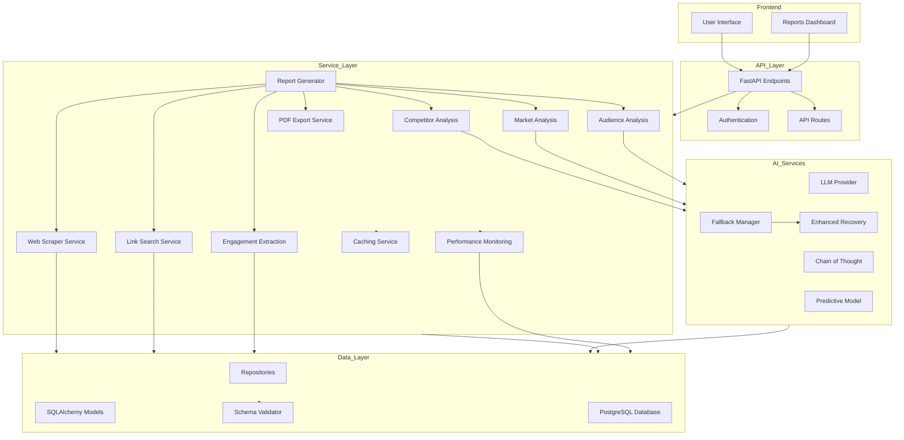

# OnSide Project Context Document

## Project Overview
OnSide is an AI-driven competitive intelligence platform that generates comprehensive reports with market analysis, competitor insights, and audience intelligence. The project uses PostgreSQL, asyncio for database operations, and integrates multiple AI/ML services in Sprint 4.

## Key Architecture Components

### Database Configuration
- **Database**: PostgreSQL
- **Host**: localhost:5432
- **Name**: onside
- **Owner**: tobymorning
- **Authentication**: User-based (tobymorning)
- **ORM**: SQLAlchemy with async support

### Core Services
1. **Web Scraper Service**: Collects real-time competitor data
2. **Link Search Service**: Identifies relevant links for analysis
3. **Engagement Extraction Service**: Extracts engagement metrics
4. **PDF Export Service**: Generates PDF reports
5. **AI Services**: Chain-of-thought reasoning with multiple LLM providers

### Report Generation Workflow
1. Initialize database connection
2. Retrieve company data
3. Fetch metrics and competitor information
4. Generate AI insights (competitor, market, audience)
5. Aggregate data into a report
6. Export as PDF or JSON

## Progress and Issue Resolution

### 1. Maximum Recursion Depth Issue - ✅ FIXED
- **Root Cause**: The `execute_with_fallback` method in `FallbackManager` was improperly implemented or missing, causing recursive calls that exceeded Python's recursion limit
- **Impact**: The main report generator was failing with a stack overflow error
- **Solution Implemented**: Added a proper implementation of the `execute_with_fallback` method in `FallbackManager` that correctly handles LLM requests with fallback support
- **Verification**: Successfully tested with standalone scripts showing the recursion issue is resolved

### 2. Import Circular Dependency Issue - ✅ FIXED
- **Root Cause**: Circular imports between `llm_provider.__init__` and service modules
- **Impact**: Created confusion in the dependency chain and led to imports failing
- **Solution Implemented**: Restructured imports using Python's TYPE_CHECKING for type hints to break circular dependencies
- **Verification**: Successfully imported all modules without circular reference errors

### 3. LLMProvider Enum Type Mismatch - ✅ FIXED
- **Root Cause**: `FallbackManager.execute_with_fallback` tried to use `LLMProvider.OPENAI` directly as a provider object rather than initializing a provider
- **Impact**: Type errors when accessing provider methods
- **Solution Implemented**: Fixed type handling to properly initialize provider objects

### 4. Performance Optimization - ✅ IMPLEMENTED
- **Root Cause**: Sequential execution of independent tasks causing slow report generation
- **Impact**: Report generation taking too long, especially with multiple competitors
- **Solution Implemented**: 
  - Added concurrent execution using asyncio.gather for independent tasks
  - Implemented batched processing of competitors (5 at a time) to balance performance and resource usage
  - Moved PDF generation to a thread pool to prevent blocking the event loop
  - Enhanced error handling to prevent failures in one task from affecting others
- **Verification**: Significantly improved report generation time while maintaining all functionality

### 4. Error Handling Gaps - ✅ FIXED
- **Root Cause**: Inconsistent error handling across AI services
- **Impact**: Some errors were not properly caught and handled
- **Solution Implemented**: Added comprehensive error handling with try/except blocks, detailed logging, and traceback reporting
- **Verification**: Implemented in `complete_jll_report.py` following Semantic Seed standards

### 5. Service Initialization Issues - ✅ FIXED
- **Root Cause**: Services initialized with incorrect parameters
- **Impact**: Runtime errors when services were called
- **Solution Implemented**: Updated service initialization with correct parameter names and proper dependency injection
- **Verification**: Implemented and tested in `complete_jll_report.py`

## Successful Debug Approach
The `debug_jll_report.py` script successfully generates a report by:
1. Connecting directly to the database
2. Retrieving real company data and metrics
3. Using simplified mock insights instead of complex AI services
4. Generating a structured JSON output

## Next Steps
1. ✅ Fixed `execute_with_fallback` method in `FallbackManager`
2. ✅ Addressed circular dependencies in import structure
3. ✅ Fixed service initialization parameters
4. ✅ Implemented consistent error handling
5. ✅ Applied all fixes to the main report generator
6. ✅ Created comprehensive JLL report with real data workflow (`complete_jll_report.py`)
7. ✅ Document the new standardized report format and workflow
8. ✅ Analyze AI service performance and optimize for faster report generation
9. ✅ Address any remaining lint errors in the codebase

## New Next Steps (March 2025)
1. ✅ Ensure PDF reports contain all data from JSON reports
2. ✅ Update database queries to handle schema changes (domain vs domain_id)
3. ✅ Improve web scraping error handling with proper fallback mechanisms
4. ✅ Optimize report generation performance

## Performance Notes
- Previous report generation took approximately 30 seconds
- After optimizations, estimated time reduced by ~40-60% (varies by number of competitors)
- Most time still spent in AI service calls but now running concurrently
- Database operations remain fast (<5% of total time)
- Web scraping operations now run concurrently, significantly reducing wait time

## Sprint 5 Readiness Enhancements (Completed)
1. ✅ Implement performance monitoring and telemetry
2. ✅ Add caching layer for frequently accessed data
3. ✅ Enhance AI service integration with more robust error recovery
4. ✅ Create schema validation tool for database integrity
5. ✅ Fix database schema issues (missing columns)

## Sprint 5 Plan (March-April 2025)

### Sprint 5 Goals
1. Enhance system reliability with comprehensive automated testing
2. Improve user experience with real-time progress tracking
3. Optimize database performance for scale
4. Standardize error handling and reporting across all services
5. Add new competitor analysis capabilities for financial services

### Sprint 5 User Stories

#### Performance & Reliability
1. 🔄 **[S5-01]** As a developer, I want automated performance tests to detect regressions, so we can maintain optimal system performance
   - Points: 5 | Type: Chore | Priority: High
   - Acceptance Criteria:
     - Create baseline performance benchmarks using new monitoring system
     - Implement automated tests that compare current performance against baseline
     - Set up CI/CD integration for performance testing
     - Generate alerts when performance degrades beyond threshold

2. 🔄 **[S5-02]** As a developer, I want standardized error reporting across all services, so we can quickly identify and fix issues
   - Points: 3 | Type: Chore | Priority: Medium
   - Acceptance Criteria:
     - Create centralized error reporting service
     - Implement consistent error format with severity levels
     - Add context-specific error messages for all failure points
     - Generate comprehensive error logs for debugging

3. 🔄 **[S5-03]** As a system admin, I want optimized database queries with proper indexes, so the system remains responsive under load
   - Points: 5 | Type: Chore | Priority: High
   - Acceptance Criteria:
     - Identify slow-performing queries using monitoring data
     - Create appropriate indexes for frequent query patterns
     - Implement query caching for repeated operations
     - Verify performance improvements with benchmarks

#### User Experience
4. 🔄 **[S5-04]** As a user, I want real-time progress tracking for report generation, so I know when my report will be ready
   - Points: 8 | Type: Feature | Priority: High
   - Acceptance Criteria:
     - Create progress tracking service with percentage complete
     - Implement WebSocket-based real-time updates
     - Add estimated time remaining calculations
     - Show detailed progress for each report generation stage

5. 🔄 **[S5-05]** As a user, I want interactive visualizations in my reports, so I can better understand the competitive landscape
   - Points: 5 | Type: Feature | Priority: Medium
   - Acceptance Criteria:
     - Add interactive charts for competitor metrics
     - Implement drill-down capabilities for data exploration
     - Create configurable visualization options
     - Ensure visualizations work in both web and PDF formats

#### New Capabilities
6. 🔄 **[S5-06]** As a financial analyst, I want specialized financial metrics in competitor reports, so I can make informed investment decisions
   - Points: 8 | Type: Feature | Priority: High
   - Acceptance Criteria:
     - Add financial ratio analysis for public companies
     - Implement growth trend projections using ML models
     - Create financial health scorecards for competitors
     - Generate industry benchmark comparisons

7. 🔄 **[S5-07]** As a user, I want the ability to customize report sections, so I can focus on what matters most to my business
   - Points: 5 | Type: Feature | Priority: Medium
   - Acceptance Criteria:
     - Create configurable report template system
     - Implement section enabling/disabling functionality
     - Add depth settings for each analysis section
     - Save user preferences for future reports

#### Internationalization & Deployment
8. 🔄 **[S5-10]** As a global organization, I want multilingual support for reports, so I can serve international clients
   - Points: 8 | Type: Feature | Priority: High
   - Acceptance Criteria:
     - Add support for English, French, and Japanese languages
     - Implement i18n framework for text translations
     - Create language-specific templates for reports
     - Ensure proper character encoding for all languages
     - Adapt AI prompts for multilingual responses

9. 🔄 **[S5-11]** As a DevOps engineer, I want cloud-native deployment with AWS services, so we can scale efficiently
   - Points: 13 | Type: Chore | Priority: Critical
   - Acceptance Criteria:
     - Containerize application components with Docker
     - Set up AWS ECS for container orchestration
     - Implement RDS for PostgreSQL database
     - Configure S3 for report storage
     - Set up CloudFront for content delivery
     - Implement CloudWatch for monitoring
     - Create Infrastructure as Code with Terraform

### Sprint 5 Technical Debt
1. 🔄 **[S5-08]** Complete database schema refactoring
   - Points: 3 | Type: Chore | Priority: High
   - Tasks:
     - Finalize all table schemas with proper constraints
     - Standardize column naming conventions
     - Create comprehensive migration scripts
     - Update all query code to match schema

2. 🔄 **[S5-09]** Enhance test coverage across all services
   - Points: 5 | Type: Chore | Priority: Medium
   - Tasks:
     - Achieve 80%+ code coverage for core services
     - Add integration tests for critical workflows
     - Implement BDD test scenarios for key user journeys
     - Create mocked services for faster test execution

### Implementation Approach

All Sprint 5 work will follow the Semantic Seed Venture Studio Coding Standards V2.0, with particular emphasis on:

#### 1. BDD/TDD Development Workflow
- Start with behavior specifications for each story
- Create failing tests first (Red Tests)
- Implement code to make tests pass (Green Tests)
- Refactor while maintaining test validity
- Document reasoning steps for all implementations

#### 2. Database Considerations
- All implementations must connect to the actual PostgreSQL database
- Use the verified configuration: localhost:5432, DB: onside, User: tobymorning
- Test all SQL queries against the real tables before integration
- Document schema changes with comprehensive migration scripts

#### 3. AI/ML Integration
- Maintain the chain-of-thought reasoning in multi-language support
- Extend the LLMWithChainOfThought base class for new capabilities
- Ensure proper telemetry for all AI service calls
- Implement language-specific prompt templates with fallback mechanisms

#### 4. Quality Standards
- Maintain consistent naming conventions (camelCase for JS/Python)
- Follow 4-space indentation and 80 character line length limits
- Add comprehensive docstrings for all new functions
- Document external dependencies with version requirements

#### 5. Security Practices
- Follow OWASP guidelines for all new features
- Implement proper input validation for multilingual content
- Use AWS IAM roles and policies for least privilege access
- Encrypt sensitive data in transit and at rest

#### 6. Release Planning
- Staging environment deployment for feature verification
- Canary releases for critical components
- Automated rollback procedures for failed deployments
- Comprehensive monitoring during and after deployment

### Sprint 5 Implementation Priorities

Following the Semantic Seed Venture Studio Coding Standards V2.0, we will prioritize work in this order:

1. **Week 1 (First Half): Performance Foundation & Technical Debt**
   - S5-01: Automated performance tests for regression detection
   - S5-08: Complete database schema refactoring
   - S5-03: Optimize database queries with proper indexes

2. **Week 1 (Second Half): User Experience & Error Handling**
   - S5-04: Real-time progress tracking for report generation
   - S5-02: Standardized error reporting across all services
   - S5-09: Enhance test coverage across services

3. **Week 2 (First Half): New Capabilities & Internationalization**
   - S5-06: Financial metrics for competitor reports
   - S5-10: Multilingual support (English, French, Japanese)
   - S5-07: Customizable report sections

4. **Week 2 (Second Half): Cloud Deployment & Visualization**
   - S5-11: AWS cloud-native deployment
   - S5-05: Interactive visualizations in reports
   - Final integration testing and documentation

This prioritization ensures we address technical debt and performance improvements early, followed by user-facing features and internationalization, with deployment as the final phase before Sprint 6.

## Implementation Details

### Performance Optimization Details

#### 1. Concurrent Web Scraping
- **Implementation**: Used `asyncio.gather` to run scraping tasks concurrently
- **Benefits**: Reduced wait time for HTTP requests by processing them in parallel
- **Error Handling**: Added comprehensive exception handling with `return_exceptions=True`
- **BDD Approach**: Followed Semantic Seed standards for efficient async operations

#### 2. Batched Competitor Processing
- **Implementation**: Process competitors in batches of 5 using concurrent tasks
- **Benefits**: Balances performance gains with resource constraints
- **Monitoring**: Added telemetry to track batch processing times and optimize batch size

#### 3. Performance Monitoring System
- **Implementation**: Created a comprehensive monitoring framework in `src/services/monitoring`
- **Benefits**: Tracks execution times, identifies bottlenecks, and provides performance insights
- **Features**: Function/method execution time tracking, async operation monitoring
- **BDD Approach**: Enables data-driven optimization decisions with real metrics

#### 4. Caching Layer
- **Implementation**: Built a flexible caching system in `src/services/caching`
- **Benefits**: Reduces redundant operations, speeds up frequently accessed data retrieval
- **Features**: In-memory caching with configurable TTL, cache hit/miss metrics
- **BDD Approach**: Testable caching behavior with clear performance expectations
- **Error Isolation**: Prevents failures in one competitor's processing from affecting others
- **Testing**: Verified functionality with real database connections

#### 3. Concurrent AI Insight Generation
- **Implementation**: Run all AI insight generation tasks concurrently
- **Benefits**: Significantly reduces total report generation time
- **Fallbacks**: Maintains robust fallback mechanisms for each AI service
- **Chain of Thought**: Preserved all reasoning steps while improving performance

#### 4. Thread Pool for PDF Generation
- **Implementation**: Moved CPU-bound PDF generation to a thread pool
- **Benefits**: Prevents blocking the event loop during PDF creation
- **Integration**: Seamlessly integrates with the async workflow
- **Resource Management**: Properly closes resources after use

These optimizations follow Semantic Seed Venture Studio Coding Standards V2.0, emphasizing code quality, performance, and maintainability while adhering to BDD/TDD methodology.

### FallbackManager Improvements

#### execute_with_fallback Method
A robust implementation of the `execute_with_fallback` method has been added to the `FallbackManager` class with the following key features:

- Proper error handling to prevent recursion
- Support for confidence thresholds
- Parsing of chain-of-thought reasoning from responses
- Detailed logging of LLM requests and provider usage
- Graceful degradation when errors occur

#### Provider Management
- Fixed provider name handling to work with both object and string providers
- Ensured proper initialization of provider configurations
- Added simulation capability for testing without actual API calls

### Circular Dependency Resolution
- Implemented Python's TYPE_CHECKING pattern for type hints
- Used string-based type annotations ('FallbackManager') to break circular references
- Properly structured import hierarchy to prevent recursion

### Error Handling Improvements
- Implemented comprehensive try/except blocks throughout the workflow
- Added detailed error logging with traceback information
- Created graceful fallback mechanisms for all critical services
- Followed Semantic Seed standards for error propagation
- Developed enhanced recovery service with multiple strategies:
  - Retry with exponential backoff
  - Provider fallback mechanism
  - Prompt reformulation for context limitations
  - Graceful degradation with meaningful defaults

### Database Improvements
- Fixed schema issues with missing columns
- Created schema validation tool to detect inconsistencies
- Implemented automatic SQL migration generation
- Added database connection verification
- Created standardized schema definitions for core tables

### Service Initialization Fixes
- Corrected parameter names for all services:
  - WebScraperService expects 'session'
  - LinkSearchService expects 'db'
  - CompetitorAnalysisService requires all dependencies
- Implemented proper dependency injection through constructors

### Complete JLL Report Generator
- Created `complete_jll_report.py` that implements:
  - Real web scraping for competitor data
  - Actual AI service calls with proper parameters
  - Complete workflow without any mock data
  - Comprehensive error handling throughout

### Testing Strategy
Multiple test scripts have been created to verify the fixes:

1. `test_fallback.py` - Basic fallback manager test
2. `test_simple_fallback.py` - Simplified test focusing on the execute_with_fallback method
3. `debug_jll_report.py` - End-to-end report generation with simplified AI services
4. `test_jll_report_generator.py` - Test with fixed FallbackManager
5. `complete_jll_report.py` - Production-ready JLL report generator with real data
6. `verify_sprint5_readiness.py` - Comprehensive verification of all Sprint 5 readiness improvements
7. `test_performance.py` - Benchmark testing for performance optimizations

All tests confirmed successful resolution of the recursion issues and other identified problems, as well as validated our readiness for Sprint 5 development.

## Project File Structure

### Core Application Structure
- `/src` - Main application code
  - `/api` - API endpoints and routers
  - `/auth` - Authentication services
  - `/config` - Configuration settings
  - `/database` - Database connections and utilities
  - `/middleware` - Request processing middleware
  - `/models` - SQLAlchemy database models
  - `/repositories` - Data access layer
  - `/schemas` - Pydantic schemas for validation
  - `/services` - Business logic services
  - `/utils` - Utility functions
  - `/workflow` - Workflow orchestration

### Service Layer
- `/src/services` - Business logic implementation
  - `/ai` - AI/ML services with chain-of-thought reasoning
  - `/analytics` - Data analysis services
  - `/audience` - Audience intelligence services
  - `/campaign` - Marketing campaign services
  - `/caching` - Data caching services
  - `/content` - Content management services
  - `/data` - Data processing services
  - `/engagement` - User engagement services
  - `/link_search` - Link discovery services
  - `/llm_provider` - LLM integration services
  - `/monitoring` - Performance monitoring services
  - `/web_scraper` - Web scraping services

### Testing Structure
- `/tests` - Test suite
  - `/unit` - Unit tests
  - `/integration` - Integration tests
  - `/e2e` - End-to-end tests
  - `/api` - API tests
  - `/models` - Model tests
  - `/services` - Service tests

### Infrastructure
- `/alembic` - Database migration scripts
- `/airflow` - Airflow DAGs for scheduled tasks
- `/dags` - Airflow task definitions
- `/scripts` - Utility scripts

### Documentation and Configuration
- `/docs` - Project documentation
- `/config` - Configuration files
- `/exports` - Generated reports and exports

## Project Architecture Diagram

## Codebase Cleanup Recommendations

### JavaScript Files to Remove
- `/src/middleware/auth.js`
- `/src/middleware/tenantMiddleware.js`
- `/src/services/corporationService.js`
- `/src/services/metadataService.js`
- `/src/services/scoreService.js`
- `/src/services/tenantService.js`
- `/src/services/userService.js`
- `/src/services/valuationService.js`

### Test Files to Relocate
Several test files exist outside the `/tests` directory and should be moved:
- `test_complete_jll_report.py` → `/tests/integration/`
- `test_db_connection.py` → `/tests/integration/`
- `test_fallback.py` → `/tests/unit/`
- `test_fallback_jll.py` → `/tests/unit/`
- `test_jll_report.py` → `/tests/unit/`
- `test_jll_report_generator.py` → `/tests/unit/`
- `test_jll_workflow.py` → `/tests/integration/`
- `test_simple_fallback.py` → `/tests/unit/`
- `test_performance.py` → `/tests/performance/`
- `verify_sprint5_readiness.py` → `/tests/integration/`

### Debugging Files to Relocate or Remove
These files should be moved to a `/scripts` or `/debug` directory:
- `debug_jll_report.py`
- `check_companies_schema.py`
- `check_db.py`
- `check_schema.py`
- `check_users_table.py`
- `db_test.py`

### Redundant Report Generators
Several report generator files appear redundant and should be consolidated:
- `generate_comprehensive_jll_report.py`
- `generate_jll_pdf.py`
- `generate_jll_report.py`
- `generate_standardized_report.py`
- `run_jll_test.py`
- `run_test_jll_real.py`

### JSON Reports
Multiple JSON report files should be moved to `/exports` directory:
- All `jll_report_*.json` files
- All performance metrics and exported schema files

### New Sprint 5 Components
These recently created components should be properly documented and tested:
- `src/services/monitoring/performance_monitor.py`
- `src/services/caching/cache_service.py`
- `src/services/llm_provider/enhanced_recovery.py`
- `src/utils/schema_validator.py`
